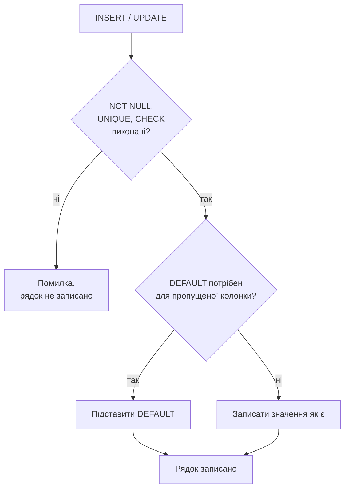

# Лекція 6. Обмеження цілісності даних: NOT NULL, UNIQUE, CHECK, DEFAULT

*Лекція 5 закріпила один тип цілісності — зв'язки між таблицями через
`FOREIGN KEY`, і одразу зроблено застереження: ця перевірка технічно
вимкнена, доки не виконано `PRAGMA foreign_keys = ON;`. Сьогоднішні
чотири обмеження — інша річ: вони діють **всередині однієї таблиці**,
не залежать від жодної PRAGMA і перевіряються SQLite завжди, без
винятків.*

## 0. Чому це не той самий випадок, що FOREIGN KEY

Коротке, але важливе уточнення одразу на початку: `NOT NULL`, `UNIQUE`,
`CHECK` і `DEFAULT` — це базові обмеження стандарту SQL, і SQLite
перевіряє їх безумовно, на кожному `INSERT` і `UPDATE`, з першого дня
роботи бази. Немає жодного перемикача, який їх вимикає (на відміну від
`PRAGMA foreign_keys`). Якщо рядок порушує будь-яке з них, SQLite
відмовляє у виконанні всієї команди — жоден рядок не потрапляє в
таблицю частково.

## 1. NOT NULL — обов'язкове значення

`NOT NULL` вже з'являвся побіжно в прикладах Лекцій 2 і 5 — тепер
зафіксуємо це формально: колонка з таким обмеженням не може лишитися
без значення. Спроба вставити `NULL` (явно чи пропустивши колонку без
`DEFAULT`) завершується помилкою:

```sql
INSERT INTO owners (last_name, phone) VALUES ('Мельник', '0671234567');
-- Runtime error: NOT NULL constraint failed: owners.first_name
```

Колонку `first_name` тут просто не передали — і, оскільки вона оголошена
`NOT NULL`, а `DEFAULT` для неї не задано, SQLite не має чим її
заповнити і зупиняє вставку повністю, а не лише цієї колонки.

## 2. UNIQUE — значення не повторюється

`UNIQUE` гарантує, що в колонці (чи наборі колонок) не буде двох
однакових значень серед усіх рядків таблиці — на відміну від
`PRIMARY KEY`, який теж унікальний, але один на таблицю і не допускає
`NULL`. `UNIQUE`-колонок може бути кілька, і, на відміну від
`PRIMARY KEY`, вона **дозволяє** `NULL` — причому одразу декільком
рядкам, бо, за логікою трьохзначної логіки з Лекції 3, `NULL` ніколи не
вважається рівним іншому `NULL`, тож два `NULL` не порушують унікальність:

```sql
phone TEXT NOT NULL UNIQUE,
email TEXT UNIQUE
```

`UNIQUE` можна оголосити і на **комбінації** кількох колонок разом —
тоді унікальним має бути саме поєднання значень, а не кожна колонка
окремо:

```sql
UNIQUE (owner_id, name)
```

Це означає: у одного власника не може бути двох тварин з однаковим
ім'ям, але тварини з іменем "Мурчик" у **різних** власників — це вже
не порушення, бо пара `(owner_id, name)` в кожному з двох рядків різна.

## 3. DEFAULT — значення, якщо не вказано інше

`DEFAULT` задає значення, яке SQLite підставить автоматично, якщо
`INSERT` не передав колонку явно. Приклад уже траплявся в Лекції 5:

```sql
copies_count INTEGER NOT NULL DEFAULT 1
```

Якщо `INSERT` не згадує `copies_count`, туди піде `1`, а не
`NULL` — і саме тому таке поєднання (`NOT NULL DEFAULT ...`) працює:
`DEFAULT` гарантує, що значення завжди буде, тож `NOT NULL` ніколи не
зірветься через просто забуту колонку.

## 4. CHECK — довільна умова на значення

`CHECK` — найгнучкіше з чотирьох: довільний булевий вираз, який SQLite
обчислює для кожного рядка при `INSERT`/`UPDATE`. Якщо вираз дає
`FALSE`, вставка чи оновлення відмовляється:

```sql
age INTEGER CHECK (age >= 0)
```

**Чим це відрізняється від типу колонки.** Type affinity з Лекції 2
контролює лише *вид* значення (число проти тексту), а не його
допустимий діапазон: `INTEGER` однаково спокійно прийме і `5`, і `-5`.
`CHECK` — саме той інструмент, який додає межі значення, які affinity
принципово не може перевірити.

## 5. Повний приклад: ветклініка з усіма чотирма обмеженнями

```sql
CREATE TABLE owners (
    id         INTEGER PRIMARY KEY,
    last_name  TEXT NOT NULL,
    first_name TEXT NOT NULL,
    phone      TEXT NOT NULL UNIQUE,
    email      TEXT UNIQUE
);

CREATE TABLE animals (
    id        INTEGER PRIMARY KEY,
    name      TEXT NOT NULL,
    species   TEXT NOT NULL,
    age       INTEGER CHECK (age >= 0),
    status    TEXT NOT NULL DEFAULT 'на обліку',
    owner_id  INTEGER NOT NULL,
    FOREIGN KEY (owner_id) REFERENCES owners (id),
    UNIQUE (owner_id, name)
);
```

Три спроби, які покажуть кожне обмеження в дії:

```sql
-- порушення UNIQUE (телефон уже є в базі)
INSERT INTO owners (last_name, first_name, phone) VALUES ('Бондар', 'Ігор', '0671234567');
-- Runtime error: UNIQUE constraint failed: owners.phone

-- порушення CHECK
INSERT INTO animals (name, species, age, owner_id) VALUES ('Кіко', 'папуга', -2, 1);
-- Runtime error: CHECK constraint failed: age >= 0

-- DEFAULT спрацьовує мовчки, без помилки
INSERT INTO animals (name, species, age, owner_id) VALUES ('Барсик', 'кіт', 3, 1);
SELECT status FROM animals WHERE name = 'Барсик';
-- на обліку
```



## Підсумок

- `NOT NULL`, `UNIQUE`, `CHECK` і `DEFAULT` діють у межах однієї
  таблиці й перевіряються SQLite завжди — на відміну від `FOREIGN KEY`,
  який залежить від `PRAGMA foreign_keys`.
- `UNIQUE` (на відміну від `PRIMARY KEY`) дозволяє кілька `NULL` і може
  охоплювати комбінацію колонок, а не лише одну.
- `DEFAULT` підставляє значення при пропущеній колонці — і часто
  працює в парі з `NOT NULL`, щоб пропуск ніколи не призводив до
  помилки.
- `CHECK` перевіряє довільну умову на значення — там, де сам тип
  колонки (type affinity) нічого не обмежує, окрім виду даних.

Досі кожен приклад лише **додавав** рядки. Наступна лекція — про
протилежну дію: як змінювати й видаляти те, що вже записано в таблиці,
і що з обмеженнями цілісності відбувається саме в цей момент.

**Практика до цієї лекції:** [Практика 5. Обмеження цілісності даних: NOT NULL, UNIQUE, CHECK, DEFAULT](../practice/05-constraints.md)
