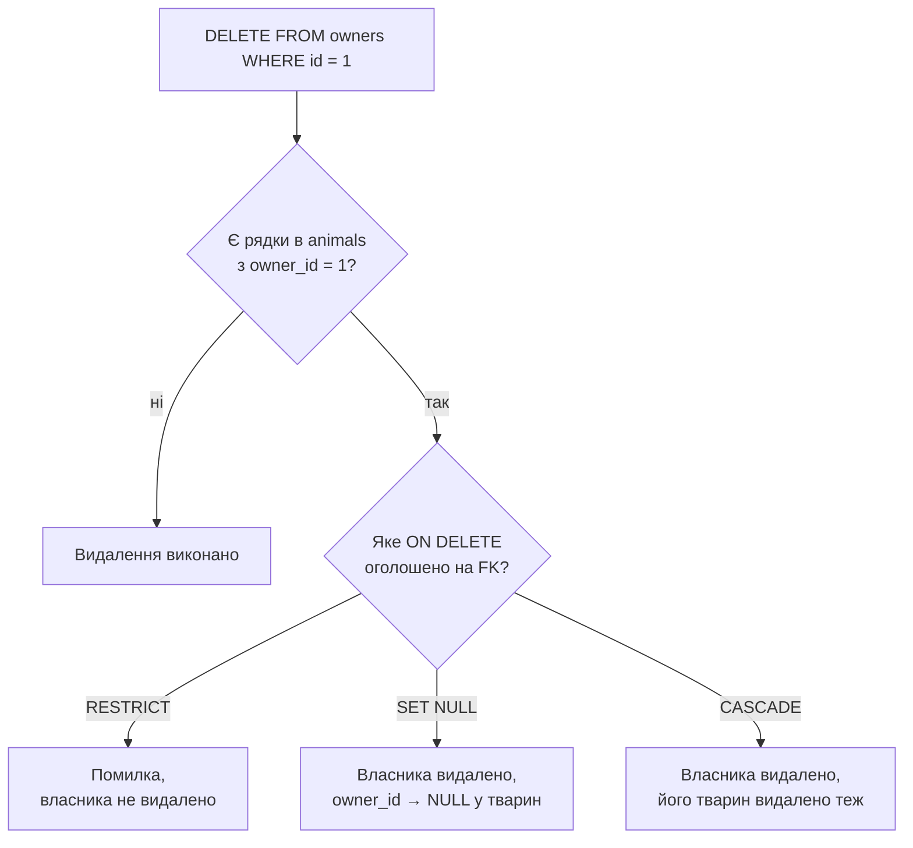

# Лекція 7. Оновлення і видалення записів: UPDATE, DELETE

*Лекція 6 показала, що відбувається з обмеженнями цілісності в момент
запису рядка. Ці ж обмеження нікуди не зникають, коли рядок уже існує
в таблиці: `UPDATE` і `DELETE` — дві команди, які змінюють чи стирають
те, що було вставлено раніше, — перевіряються тими самими правилами,
що й `INSERT`.*

## 1. UPDATE: зміна існуючих рядків

```sql
UPDATE animals
SET age = 4
WHERE name = 'Мурчик';
```

`SET` перелічує, які колонки й на які нові значення змінити; `WHERE`
визначає, **яких** рядків це стосується — синтаксично той самий
`WHERE`, що й у `SELECT` з Лекції 3, з тими самими операторами
порівняння.

**Найважливіше попередження цієї лекції.** `WHERE` в `UPDATE` —
необов'язковий синтаксично, але його відсутність означає: змінити
**всі** рядки таблиці одночасно.

```sql
-- оновлює вік УСІХ тварин у таблиці, а не тільки Мурчика
UPDATE animals SET age = 4;
```

Це не помилка синтаксису — SQLite виконає команду точно так, як
написано, без попередження. Перш ніж натиснути Enter на `UPDATE`,
завжди варто спершу подумки (або реальним `SELECT` з тим самим
`WHERE`) перевірити, скільки саме рядків підпадає під умову.

Кілька колонок оновлюються однією командою через кому:

```sql
UPDATE animals
SET age = age + 1, status = 'на обліку'
WHERE owner_id = 1;
```

Вираз `age = age + 1` показує ключову властивість `SET`: праворуч від
`=` можна використати **поточне** значення тієї самої колонки — новий
вік обчислюється на основі старого, а не задається наперед відомим
числом.

**Обмеження цілісності з Лекції 6 діють і тут.** Спроба `UPDATE`, яка
порушує `CHECK`, `UNIQUE` чи `NOT NULL`, відмовляється точно так само,
як і порушений `INSERT`:

```sql
UPDATE animals SET age = -1 WHERE name = 'Мурчик';
-- Runtime error: CHECK constraint failed: age >= 0
```

## 2. DELETE: видалення рядків

```sql
DELETE FROM animals
WHERE name = 'Кіко';
```

`DELETE FROM таблиця WHERE умова` стирає рядки, що задовольняють умову,
повністю — на відміну від `UPDATE`, тут немає `SET`, бо видаляється
весь рядок, а не окрема колонка. І те саме попередження, ще гостріше:

```sql
-- видаляє геть усі рядки з animals
DELETE FROM animals;
```

Без `WHERE` це видаляє все, і, на відміну від помилки типу чи
обмеження, тут немає ніякого повідомлення, яке зупинило б виконання —
дані просто зникають. Це одна з причин, чому реальні бази регулярно
резервно копіюють: `DELETE` без `WHERE` (чи з надто широкою умовою) —
не рідкість серед типових інцидентів втрати даних.

## 3. DELETE і зовнішні ключі: коли Лекція 5 повертається

`DELETE` з "батьківської" таблиці — тієї, на яку посилається
`FOREIGN KEY` з іншої таблиці — це саме той момент, коли на практиці
спрацьовує правило `ON DELETE`, обране в Лекції 5:

```sql
DELETE FROM owners WHERE id = 1;
```

Якщо для `animals.owner_id` було оголошено `ON DELETE RESTRICT` (як і
рекомендувала Лекція 5 для ветклініки), ця команда завершиться
помилкою, доки в `animals` лишається хоч один рядок з `owner_id = 1`:

```
Runtime error: FOREIGN KEY constraint failed
```

Якби замість `RESTRICT` було обрано `SET NULL`, ця сама команда
виконалася б, а всі відповідні `owner_id` в `animals` стали б `NULL`;
при `CASCADE` — видалення власника видалило б і всіх його тварин.
Один і той самий `DELETE`, три принципово різні наслідки — залежно від
рішення, ухваленого ще на етапі `CREATE TABLE`.



## Підсумок

- `UPDATE таблиця SET колонка = значення, ... WHERE умова` змінює
  існуючі рядки; вираз праворуч від `=` може посилатися на поточне
  значення тієї самої колонки.
- `DELETE FROM таблиця WHERE умова` видаляє рядки повністю, без
  часткового видалення окремих колонок.
- Відсутність `WHERE` в обох командах означає "усі рядки" — це
  найпоширеніша й найдорожча помилка теми; перевіряти умову `SELECT`-ом
  заздалегідь — гарна звичка.
- Обмеження цілісності з Лекції 6 (`NOT NULL`, `UNIQUE`, `CHECK`)
  перевіряються і при `UPDATE`, не лише при `INSERT`.
- `DELETE` з таблиці, на яку посилається `FOREIGN KEY`, підпорядковане
  правилу `ON DELETE`, обраному при `CREATE TABLE` (Лекція 5):
  `RESTRICT` забороняє, `SET NULL` обнуляє посилання, `CASCADE` тягне
  видалення далі.

**Практика до цієї лекції:** [Практика 6. Робота з командами оновлення та видалення у SQLite](../practice/06-update-delete.md)
