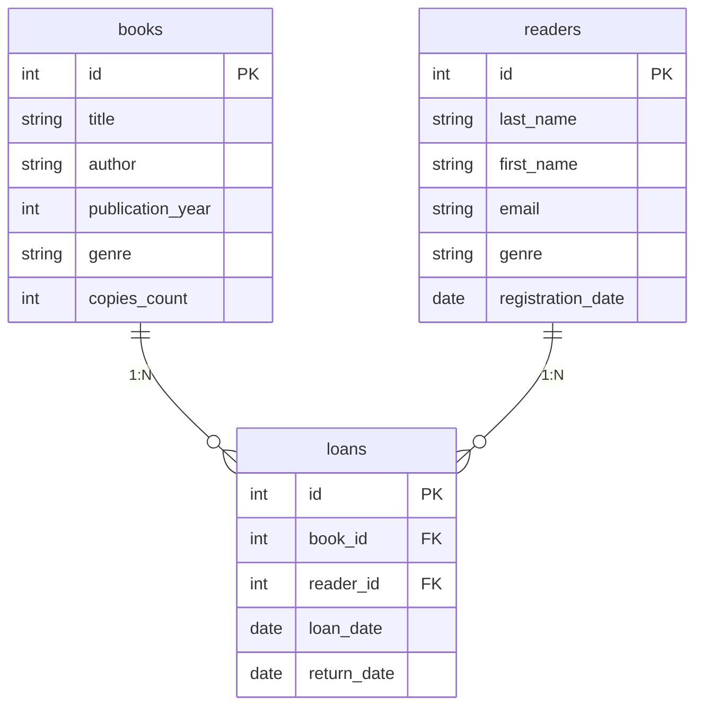

# Звіт до Практичної роботи №2
**Виконала:** Студентка групи IT-31 Наумчук Владислава

---

## Завдання 1. ER-діаграма повної схеми

---

## Завдання 2. Тип кожного зв'язку

* **`books` - `loans` (тип 1:N):** Одна книга може видаватися багато разів і мати багато записів у таблиці видач, але кожен окремий запис видачі стосується лише однієї конкретної книги.
* **`readers` - `loans` (тип 1:N):** Один читач може брати книги багато разів і мати багато записів про видачу, але кожен окремий запис у таблиці видач належить лише одному конкретному читачеві.

---

## Завдання 3. Первинні й зовнішні ключі кожної таблиці

* **Таблиця `books`:**
  * Первинний ключ (PK): `id`
  * Зовнішні ключі (FK): відсутні

* **Таблиця `readers`:**
  * Первинний ключ (PK): `id`
  * Зовнішні ключі (FK): відсутні

* **Таблиця `loans`:**
  * Первинний ключ (PK): `id`
  * Зовнішні ключі (FK): `book_id` (посилається на `books.id`), `reader_id` (посилається на `readers.id`)

---

## Завдання 4. Додавання нової сутності

Додаємо нову вимірну таблицю **`publishers`** ("Видавництва") з атрибутами `id` (PK) та `name`. 

У системі з'явиться новий зв'язок типу **1:N** між `publishers` та `books` (одне видавництво може видати багато книг, але кожна книга видана одним видавництвом). У таблицю `books` додасться новий зовнішній ключ `publisher_id`.

---

## Завдання 5. Порівняння з прикладом (Хімчистка)

Моя діаграма повністю повторює структуру прикладу хімчистки:

1. **Кількість і типи таблиць:** Як і в хімчистці (`services`, `clients`, `orders`), моя схема має дві вимірні таблиці-довідники (`books` відповідає `services`, `readers` відповідає `clients`) та одну центральну фактову таблицю (`loans` відповідає `orders`).
2. **Зовнішні ключі та кардинальність:** Фактова таблиця `loans` містить два зовнішні ключі (`book_id` та `reader_id`), аналогічно до `service_id` та `client_id` у таблиці `orders`. Обидва зв'язки в моїй діаграмі мають тип **1:N** (`books ||--o{ loans` та `readers ||--o{ loans`), оскільки одна книга чи читач можуть мати багато записів у видачах, але кожен запис видачі стосується чітко однієї книги та одного читача.
3. **Взаємозв'язок вимірних таблиць:** Прямого зв'язку між `books` та `readers` немає (як і між `services` та `clients`). Вони пов'язані виключно через фактову таблицю `loans`, яка фіксує саму подію видачі.

## Контролюючі запитання

**Питання 1: Чим логічна модель відрізняється від концептуальної, і чим фізична — від логічної?**

* **Концептуальна vs Логічна:** Концептуальна схема — це лише загальна ідея ("начерк на серветці"), де вказані тільки основні об'єкти та як вони пов'язані. Логічна модель — це вже детальне креслення: у ній додані всі поля, названі первинні й зовнішні ключі та чіткі типи зв'язків.
* **Логічна vs Фізична:** Логічна модель описує структуру взагалі (на папері), незалежно від програм. Фізична модель — це готова інструкція для конкретної бази даних (PostgreSQL, SQLite тощо), де вказані точні типи даних (наприклад, `VARCHAR(255)`), обмеження та налаштування збереження.

---

**Питання 2: Чому зв'язок M:N не можна реалізувати двома зовнішніми ключами в одній із двох основних таблиць і завжди потрібна окрема таблиця?**

У клітинку реляційної таблиці можна записати лише одне конкретне значення, а не цілий список. Якщо один читач бере 5 книг, ми не можемо вписати 5 різних ID в один рядок таблиці читачів. Спроба створювати дублікати рядків заплутає базу даних і призведе до помилок. 

Тому для зв'язку "багато-до-багатьох" завжди роблять третю (проміжну) таблицю, яка перетворює один складний зв'язок M:N на два простих зв'язки 1:N.

---

**Питання 3: Що означають позначення `||`, `o{`, `|{` у синтаксисі Mermaid `erDiagram`, і як прочитати вголос рядок `A ||--o{ B`?**

* **Значення позначок:**
  * `||` — Рівно один (обов'язково один).
  * `o{` — Нуль або багато (може не бути взагалі, а може бути декілька).
  * `|{` — Один або багато (щонайменше один є обов'язково).

* **Як прочитати вголос `A ||--o{ B`:**
  > "Рівно один об'єкт A відповідає нулю або багатьом об'єктам B" (наприклад: *один читач може мати нуль або багато виданих книг*).