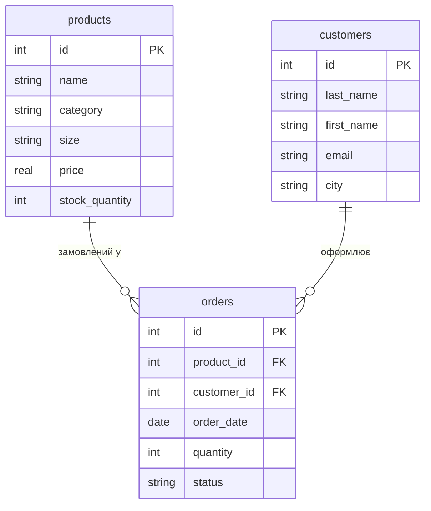

## Завдання 1. ER-діаграма повної схеми



---

## Завдання 2. Тип кожного зв'язку

- **products ||--o{ orders — 1:N.** Один товар (наприклад, "футболка синя, розмір M") може бути замовлений нуль або багато разів різними покупцями, але кожне конкретне замовлення стосується рівно одного товару.
- **customers ||--o{ orders — 1:N.** Один покупець може оформити нуль або багато замовлень, але кожне замовлення оформлює рівно один покупець.

Прямого зв'язку між `products` і `customers` немає — вони з'єднані лише через фактову таблицю `orders`.

---

## Завдання 3. Первинні й зовнішні ключі кожної таблиці

**products**
- PK: `id`
- FK: немає

**customers**
- PK: `id`
- FK: немає

**orders**
- PK: `id`
- FK: `product_id` → `products.id`
- FK: `customer_id` → `customers.id`

---

## Завдання 4. Якщо додати ще одну сутність

Додамо сутність **categories** (категорії товарів: наприклад, "верхній одяг", "взуття", "аксесуари"). Кожен товар належить рівно одній категорії, а одна категорія містить багато товарів — зв'язок **1:N**:

```
categories ||--o{ products : "містить"
```

Нова таблиця `categories(id PK, name)`. У `products` з'явиться новий стовпець `category_id FK → categories.id`. Прямого зв'язку між `categories` і `orders` чи `customers` не буде.

---

## Завдання 5. Порівняння з прикладом хімчистки

Структура ідентична прикладу з хімчистки: дві вимірні таблиці (`products` ↔ `services`, `customers` ↔ `clients`) і одна фактова таблиця з двома FK (`orders` ↔ `orders`). В обох випадках обидва зв'язки — 1:N, і обидві вимірні таблиці пов'язані лише опосередковано, через фактову таблицю, а не напряму одна з одною.

---

## Контрольні питання

**1. Чим логічна модель відрізняється від концептуальної, і чим фізична — від логічної?**

Концептуальна модель описує предметну область словами й сутностями без технічних деталей (просто "товар", "покупець", "замовлення" і зв'язки між ними). Логічна модель — це вже конкретні таблиці, стовпці, абстрактні типи даних (int, string, date), PK/FK, але ще не прив'язана до конкретної СУБД (саме такою є діаграма вище). Фізична модель — це реальна реалізація в конкретній СУБД (наприклад SQLite чи PostgreSQL) з точними типами даних (INTEGER, TEXT, REAL), обмеженнями, індексами тощо — те, що з'явиться у файлі `.db` у Практиці 4.

**2. Чому зв'язок M:N не можна реалізувати двома зовнішніми ключами в одній із двох основних таблиць і завжди потрібна окрема таблиця?**

Якщо додати FK у одну з таблиць, кожен її рядок може посилатись лише на один рядок іншої таблиці — а M:N вимагає, щоб один рядок з одного боку відповідав багатьом рядкам з іншого боку, і навпаки. Один стовпець FK фізично не може зберігати кілька значень одночасно. Тому потрібна окрема проміжна (з'єднувальна) таблиця, де кожен рядок містить пару FK — по одному на кожну з двох таблиць, — що дозволяє будь-якій комбінації записів з обох сторін існувати одночасно.

**3. Що означають позначення `||`, `o{`, `|{` у синтаксисі mermaid erDiagram, і як прочитати вголос рядок `A ||--o{ B`?**

- `||` — рівно один (обов'язково один, не менше й не більше).
- `o{` — нуль або багато.
- `|{` — один або багато (мінімум один).

Рядок `A ||--o{ B` читається так: "Рівно один запис A відповідає нулю або багатьом записам B" (і, відповідно, кожен запис B відповідає рівно одному запису A).
