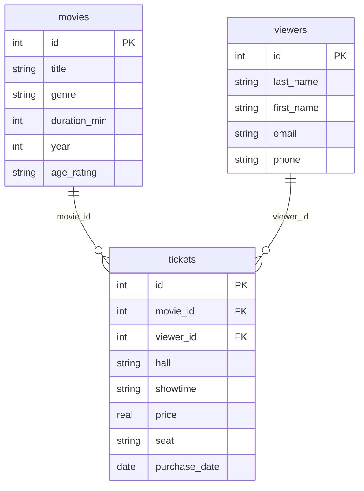

# Практична робота №3

## Тема: Створення ER-діаграми

**Варіант 3 — Кінотеатр**

## Завдання 1. ER-діаграма

## Завдання 2. Тип зв'язків

**movies → tickets** — зв'язок 1:N. Один фільм може мати багато квитків, а кожен квиток належить одному фільму.

**viewers → tickets** — зв'язок 1:N. Один глядач може купити багато квитків, а кожен квиток належить одному глядачу.

## Завдання 3. Первинні та зовнішні ключі

### Таблиця movies
- PK: id
- FK: немає.

### Таблиця viewers
- PK: id
- FK: немає.

### Таблиця tickets
- PK: id
- FK: movie_id → movies.id
- FK: viewer_id → viewers.id

## Завдання 4. Нова сутність

**CinemaHalls** — інформація про кінозали.

Зв'язок: CinemaHalls (1) → Tickets (N). Один зал використовується для багатьох сеансів.

## Завдання 5. Порівняння з прикладом

Схема кінотеатру має дві таблиці-виміри (movies, viewers) та одну фактову таблицю (tickets). Обидва зв'язки мають тип 1:N, а таблиці-виміри пов'язані між собою лише через таблицю tickets.

## Контрольні питання

### 1. Чим логічна модель відрізняється від концептуальної, а фізична — від логічної?

Концептуальна модель описує предметну область без технічних деталей. Логічна модель визначає таблиці, атрибути та зв'язки. Фізична модель описує реалізацію в конкретній СУБД.

### 2. Чому зв'язок M:N реалізується окремою таблицею?

Тому що один запис може бути пов'язаний з багатьма записами іншої таблиці, тому створюється проміжна таблиця із зовнішніми ключами.

### 3. Що означають позначення ||, o{, |{?

- || — рівно один.
- o{ — нуль або багато.
- |{ — один або багато.

Запис `A ||--o{ B` означає: одному запису таблиці A може відповідати нуль або багато записів таблиці B.

## Висновок

Було створено ER-діаграму предметної області «Кінотеатр», визначено первинні та зовнішні ключі, описано зв'язки між таблицями та запропоновано додаткову сутність для розширення бази даних.
