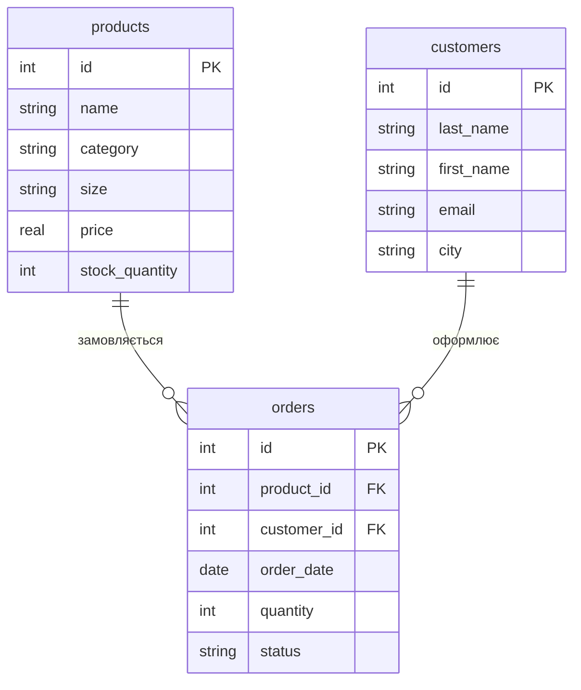

# Практична робота №3

## Створення ER-діаграми

**Виконав:** Лещук Ірина
**Група:** ІТ-31
**Варіант:** 2
**Предметна область:** Інтернет-магазин одягу

## Завдання 1. ER-діаграма повної схеми

Предметна область: інтернет-магазин одягу.

```mermaid
erDiagram
    products ||--o{ orders : "замовляється"
    customers ||--o{ orders : "оформлює"

    products {
        int id PK
        string name
        string category
        string size
        real price
        int stock_quantity
    }

    customers {
        int id PK
        string last_name
        string first_name
        string email
        string city
    }

    orders {
        int id PK
        int product_id FK
        int customer_id FK
        date order_date
        int quantity
        string status
    }
```

## Завдання 2. Тип кожного зв'язку

Зв'язок між `products` і `orders` — **1:N (один до багатьох)**. Один товар може бути присутнім у нульовій, одній або багатьох заявках на замовлення, але кожне конкретне замовлення стосується одного товару. Зовнішній ключ `product_id` у таблиці `orders` посилається на `products.id`.

Зв'язок між `customers` і `orders` — **1:N (один до багатьох)**. Один клієнт може оформити нульове, одне або багато замовлень, але кожне конкретне замовлення оформлюється одним клієнтом. Зовнішній ключ `customer_id` у таблиці `orders` посилається на `customers.id`.

## Завдання 3. Первинні й зовнішні ключі кожної таблиці

### Таблиця `products`

Первинний ключ: `id`.

Зовнішні ключі: відсутні.

### Таблиця `customers`

Первинний ключ: `id`.

Зовнішні ключі: відсутні.

### Таблиця `orders`

Первинний ключ: `id`.

Зовнішні ключі: `product_id` → `products.id`; `customer_id` → `customers.id`.

## Завдання 4. Якщо додати ще одну сутність

До предметної області можна додати сутність `categories` — категорії товарів. Нова таблиця може містити такі стовпці: `id`, `name`, `description`.

У таблиці `products` можна додати зовнішній ключ `category_id`, який посилатиметься на `categories.id`. Між `categories` і `products` буде зв'язок **1:N**: одна категорія може містити багато товарів, а кожен товар належить до однієї категорії.

На діаграмі з'явиться нова таблиця `categories`, яка буде пов'язана з таблицею `products`. Фактова таблиця `orders` при цьому залишиться пов'язаною з `products` і `customers`.

## Завдання 5. Порівняння з прикладом

Моя ER-діаграма інтернет-магазину одягу структурно схожа на приклад із хімчисткою. В обох випадках є дві вимірні таблиці та одна фактова таблиця.

У моєму варіанті вимірними таблицями є `products` і `customers`, а фактовою — `orders`. У прикладі хімчистки вимірними таблицями є `services` і `clients`, а фактовою — `orders`.

В обох схемах фактова таблиця має власний первинний ключ і два зовнішні ключі. Обидва зв'язки мають тип **1:N**. Дві вимірні таблиці не пов'язані між собою безпосередньо, а з'єднуються через фактову таблицю.

## Контрольні питання

### 1. Чим логічна модель відрізняється від концептуальної, і чим фізична — від логічної?

**Концептуальна модель** описує предметну область на загальному рівні: які існують сутності, їхні властивості та зв'язки між ними, без прив'язки до конкретної СУБД.

**Логічна модель** перетворює концептуальну модель у структуру таблиць, стовпців, первинних і зовнішніх ключів та зв'язків між таблицями. При цьому вона ще не обов'язково враховує конкретні особливості певної СУБД.

**Фізична модель** описує безпосередню реалізацію бази даних у конкретній СУБД. Вона визначає конкретні типи даних, обмеження, індекси та інші технічні особливості реалізації.

### 2. Чому зв'язок M:N не можна реалізувати двома зовнішніми ключами в одній із двох основних таблиць і завжди потрібна окрема таблиця?

Зв'язок M:N означає, що один запис першої таблиці може бути пов'язаний із багатьма записами другої, і навпаки. Двома зовнішніми ключами в одній таблиці неможливо зберегти довільну кількість таких зв'язків без повторення даних або складної структури.

Тому для зв'язку M:N створюють окрему проміжну таблицю. Вона містить зовнішні ключі на обидві основні таблиці. Кожен рядок цієї таблиці представляє один конкретний зв'язок між записами двох таблиць.

### 3. Що означають позначення `||`, `o{`, `|{` у синтаксисі Mermaid `erDiagram`?

Позначення `||` означає **рівно один**.

Позначення `o{` означає **нуль або багато**.

Позначення `|{` означає **один або багато**.

Рядок `A ||--o{ B` читається як: **один запис A пов'язаний із нулем або багатьма записами B**. Тобто це зв'язок **1:N**.

## Висновок

Під час практичної роботи було спроєктовано повну ER-модель предметної області «Інтернет-магазин одягу». Визначено дві вимірні таблиці `products` і `customers` та фактову таблицю `orders`. Для фактової таблиці визначено два зовнішні ключі: `product_id` → `products.id` та `customer_id` → `customers.id`. Обидва зв'язки мають тип 1:N. Також було розглянуто можливість додавання нової сутності `categories` та проаналізовано відмінності між концептуальною, логічною та фізичною моделями бази даних.
