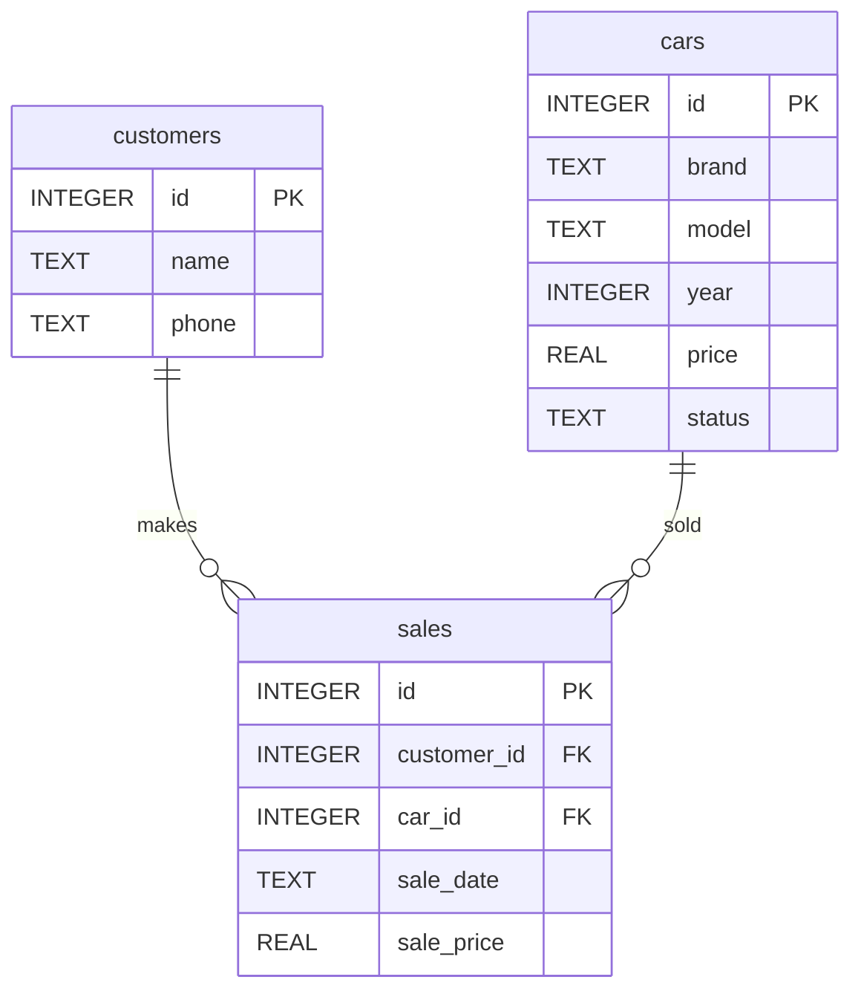

Практична робота №3

Варіант: 5
Тема: Автосалон

Завдання 1. ER-діаграма

## Завдання 2. Типи зв'язків

Між `customers` і `sales` встановлено зв'язок 1:N, оскільки один клієнт може здійснити багато покупок. Між `cars` і `sales` також встановлено зв'язок 1:N, оскільки один автомобіль може бути пов'язаний із кількома записами про продаж.
## Завдання 3. Первинні й зовнішні ключі

**Таблиця `customers`:**
- первинний ключ — `id`;
- зовнішніх ключів немає.

**Таблиця `cars`:**
- первинний ключ — `id`;
- зовнішніх ключів немає.

**Таблиця `sales`:**
- первинний ключ — `id`;
- `customer_id` — зовнішній ключ, посилається на `customers(id)`;
- `car_id` — зовнішній ключ, посилається на `cars(id)`.

## Завдання 4. Додавання нової сутності

До предметної області можна додати таблицю `managers` для зберігання інформації про менеджерів автосалону. У таблиці `sales` з'явиться зовнішній ключ `manager_id`, який посилатиметься на `managers(id)`. Між `managers` і `sales` буде зв'язок 1:N, оскільки один менеджер може оформити багато продажів.

## Завдання 5. Порівняння з прикладом

Моя діаграма автосалону структурно схожа на діаграму хімчистки. В обох випадках є дві вимірні таблиці та одна фактова таблиця з двома зовнішніми ключами. Обидва зв'язки мають тип 1:N, а дві вимірні таблиці пов'язані лише через фактову таблицю, а не напряму.

## Контрольні питання

### 1. Чим логічна модель відрізняється від концептуальної, і чим фізична — від логічної?

Концептуальна модель показує основні сутності та зв'язки між ними. Логічна модель визначає таблиці, стовпці, ключі та зв'язки між таблицями. Фізична модель описує, як ця структура буде реалізована в конкретній СУБД, наприклад SQLite.

### 2. Чому зв'язок M:N не можна реалізувати двома зовнішніми ключами в одній із двох основних таблиць?

Тому що при зв'язку M:N один запис першої таблиці може бути пов'язаний із багатьма записами другої, і навпаки. Тому потрібна окрема проміжна таблиця, яка зберігає зовнішні ключі обох таблиць.

### 3. Що означають позначення ||, o{, |{ у синтаксисі Mermaid erDiagram?

`||` означає «рівно один», `o{` — «нуль або багато», `|{` — «один або багато». Рядок `A ||--o{ B` означає, що один запис A може бути пов'язаний із нулем або багатьма записами B, тобто це зв'язок 1:N.