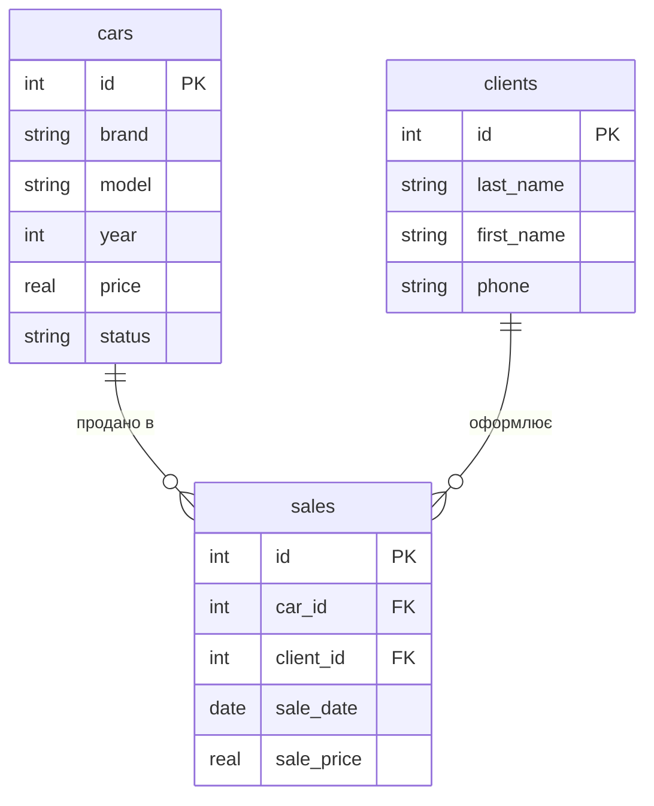

# Практика 3. ER-діаграма — Варіант 5 (Автосалон)

## Завдання 1. ER-діаграма повної схеми

## Завдання 2. Тип кожного зв'язку

- **`cars ||--o{ sales` — 1:N.** Одне авто відповідає нулю або кільком записам продажів, а кожен запис продажу стосується рівно одного авто.
- **`clients ||--o{ sales` — 1:N.** Один клієнт відповідає нулю або кільком записам продажів, а кожен запис продажу оформлює рівно один клієнт.

## Завдання 3. Первинні й зовнішні ключі кожної таблиці

**`cars`**
- (а) Первинний ключ: `id`
- (б) Зовнішніх ключів немає

**`clients`**
- (а) Первинний ключ: `id`
- (б) Зовнішніх ключів немає

**`sales`**
- (а) Первинний ключ: `id`
- (б) Зовнішні ключі:
  - `car_id` → посилається на `cars(id)`
  - `client_id` → посилається на `clients(id)`

## Завдання 4. Якщо додати ще одну сутність

Додав би сутність **`manufacturers`** (виробники): кожен автомобіль випущений одним виробником, а один виробник випустив багато автомобілів — новий зв'язок `manufacturers ||--o{ cars` типу 1:N, реалізований новим зовнішнім ключем `manufacturer_id` у таблиці `cars`.

## Завдання 5. Порівняння з прикладом

Структура повністю збігається з прикладом хімчистки: дві вимірні таблиці (`cars`, `clients`) і одна фактова (`sales`) з двома FK, обидва зв'язки — 1:N, і `cars` та `clients` пов'язані лише через `sales`, а не напряму.
