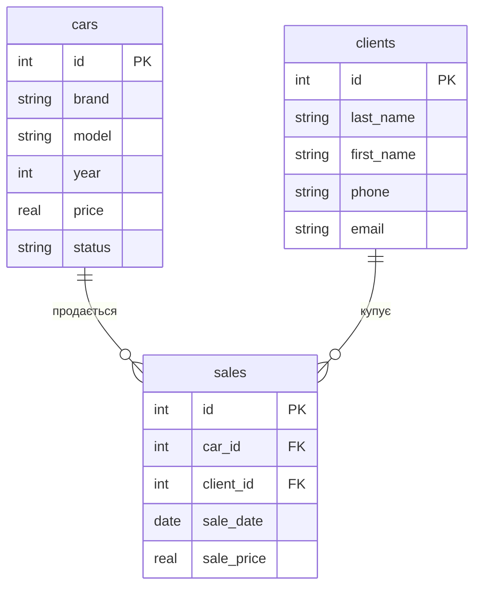

# Практична 3
## Створення ER-діаграми

Варіант 5 — Автосалон

## Завдання 1. ER-діаграма повної схеми

# Завдання 2
Зв’язок cars — sales має тип 1:N. Один автомобіль може бути пов’язаний із записом про продаж, а кожен продаж стосується одного автомобіля. Зв’язок clients — sales має тип 1:N. Один клієнт може мати декілька покупок, а кожен продаж належить одному клієнту.

# Завдання 3
cars:
Первинний ключ — id.
Зовнішніх ключів немає.

clients:
Первинний ключ — id.
Зовнішніх ключів немає.

sales:
Первинний ключ — id.
car_id — зовнішній ключ на cars.id.
client_id — зовнішній ключ на clients.id.

# Завдання 4
До схеми автосалону можна додати таблицю employees з даними про працівників
Її можна пов’язати з таблицею sales. Один працівник може оформити багато продажів, а кожен продаж оформлює один працівник. Тип зв’язку — 1:N

# Завдання 5
Моя ER-діаграма автосалону схожа на приклад хімчистки. В обох схемах є дві вимірні таблиці та одна фактова таблиця з двома зовнішніми ключами. В автосалоні вимірні таблиці — cars і clients, фактова — sales. В обох схемах зв’язки мають тип 1:N, а дві вимірні таблиці напряму не пов’язані

Контрольні питання
1. Чим логічна модель відрізняється від концептуальної, а фізична — від логічної?
        Концептуальна показує сутності й зв’язки. Логічна wt ще поля та ключі. Фізична вже як це реально створюється в базі
2. Чому зв’язок M:N не можна реалізувати двома зовнішніми ключами в одній таблиці?
        Бо з обох сторін може бути багато записів. Тому потрібна окрема проміжна таблиця
3. Що означають ||, o{, |{?
        || — рівно один
        o{ — нуль або багат
        |{ — один або багато
        A ||–o{ B — один A може мати нуль або багато B, а кожен B належить одному A
