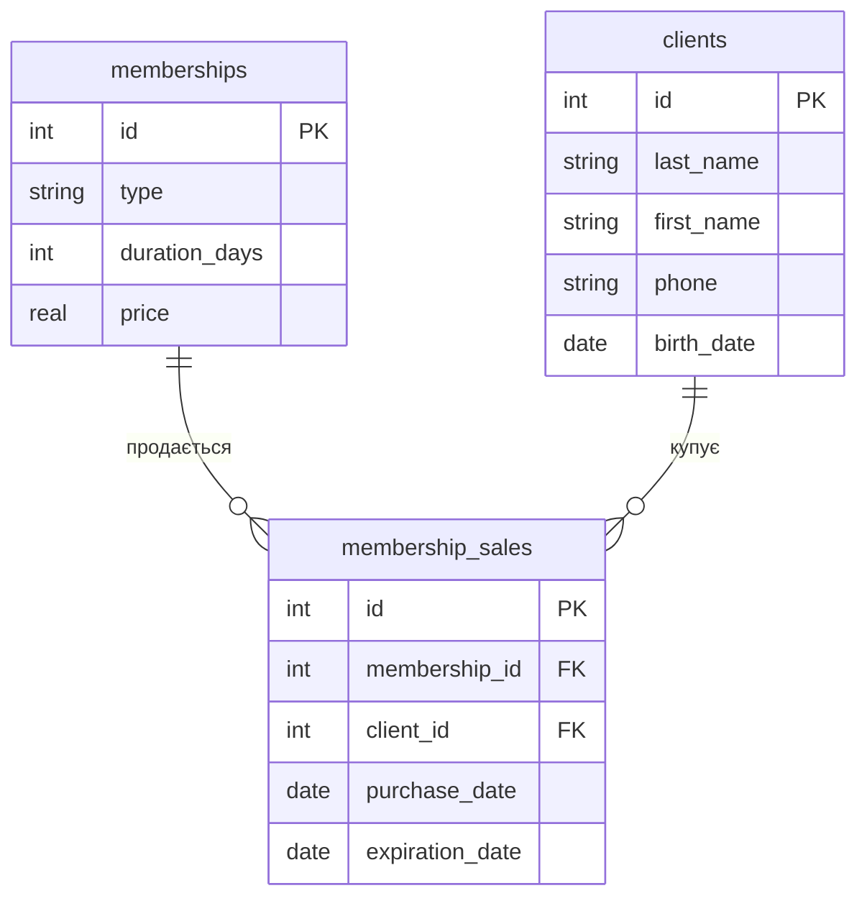

# Практика 3. Створення ER-діаграм

**Номер варіанта:** 7  
**Тема:** Спортзал (фітнес-клуб)

## Завдання 1. ER-діаграма повної схеми

## Завдання 2. Тип кожного зв'язку

### Зв'язок memberships — membership_sales

Це зв'язок **1:N (один-до-багатьох)**. Один вид абонемента може бути проданий нуль або багато разів різним клієнтам. Водночас кожен запис про продаж стосується рівно одного виду абонемента, на який посилається `membership_id`.

### Зв'язок clients — membership_sales

Це зв'язок **1:N (один-до-багатьох)**. Один клієнт може придбати нуль або багато абонементів протягом часу. Кожен конкретний запис у `membership_sales` належить рівно одному клієнту, якого визначає `client_id`.

Прямого зв'язку між `memberships` і `clients` немає. Вони пов'язані через фактову таблицю `membership_sales`.

## Завдання 3. Первинні й зовнішні ключі кожної таблиці

### Таблиця memberships

- Первинний ключ: `id`.
- Зовнішні ключі: відсутні.

### Таблиця clients

- Первинний ключ: `id`.
- Зовнішні ключі: відсутні.

### Таблиця membership_sales

- Первинний ключ: `id`.
- Зовнішній ключ: `membership_id` → `memberships.id`.
- Зовнішній ключ: `client_id` → `clients.id`.

## Завдання 4. Якщо додати ще одну сутність

До предметної області можна додати сутність `trainers` (тренери).

Нова таблиця може мати такі стовпці:

`trainers(id, last_name, first_name, phone, specialization)`

Для зв'язку тренерів із клієнтами можна додати окрему таблицю `training_sessions`:

`training_sessions(id, trainer_id, client_id, session_date)`

У цьому випадку між `trainers` і `clients` існує зв'язок **M:N (багато-до-багатьох)**: один тренер може проводити заняття з багатьма клієнтами, а один клієнт може займатися з різними тренерами.

Тому потрібна проміжна таблиця `training_sessions`. Вона містить зовнішній ключ `trainer_id` → `trainers.id` та зовнішній ключ `client_id` → `clients.id`.

Таким чином, зв'язок M:N реалізується через два зв'язки 1:N.

## Завдання 5. Порівняння з прикладом

Моя діаграма для фітнес-клубу структурно схожа на діаграму хімчистки з прикладу.

В обох випадках є дві вимірні таблиці та одна фактова таблиця. Для фітнес-клубу це `memberships`, `clients` і `membership_sales`, а для хімчистки — `services`, `clients` і `orders`.

В обох схемах фактова таблиця має власний первинний ключ і два зовнішні ключі.

Обидва зв'язки в обох схемах є **1:N**. Один абонемент може зустрічатися в багатьох продажах, а один клієнт може мати багато записів про придбання абонементів.

Також у двох схемах вимірні таблиці не мають прямого зв'язку між собою. Вони пов'язані тільки через фактову таблицю.

# Контрольні питання

## 1. Чим логічна модель відрізняється від концептуальної, і чим фізична — від логічної?

Концептуальна модель описує предметну область на високому рівні: які існують сутності, їх основні властивості та зв'язки між ними.

Логічна модель деталізує концептуальну модель до структури таблиць. У ній визначаються таблиці, стовпці, первинні та зовнішні ключі, а також зв'язки між таблицями.

Фізична модель описує реалізацію бази даних у конкретній СУБД. У ній визначаються точні типи даних, обмеження, індекси та інші особливості реалізації.

Отже, концептуальна модель описує предметну область, логічна — структуру бази даних, а фізична — її конкретну реалізацію.

## 2. Чому зв'язок M:N не можна реалізувати двома зовнішніми ключами в одній із двох основних таблиць і завжди потрібна окрема таблиця?

Зв'язок M:N означає, що один запис першої таблиці може бути пов'язаний з багатьма записами другої, і навпаки.

Один зовнішній ключ посилається на один конкретний запис іншої таблиці. Тому зберігати багато пов'язаних значень в одному полі було б неправильно з точки зору реляційної моделі.

Для реалізації M:N створюють окрему проміжну таблицю. Вона містить зовнішній ключ на першу таблицю та зовнішній ключ на другу таблицю. Кожен рядок проміжної таблиці представляє один зв'язок між двома записами.

Таким чином, зв'язок M:N розкладається на два зв'язки 1:N.

## 3. Що означають позначення ||, o{, |{ у синтаксисі Mermaid erDiagram, і як прочитати вголос рядок A ||--o{ B?

Позначення `||` означає "рівно один".

Позначення `o{` означає "нуль або багато".

Позначення `|{` означає "один або багато".

Рядок `A ||--o{ B` означає: один запис A може бути пов'язаний з нулем або багатьма записами B.

Отже, такий зв'язок має кардинальність **1:N (один-до-багатьох)**.
