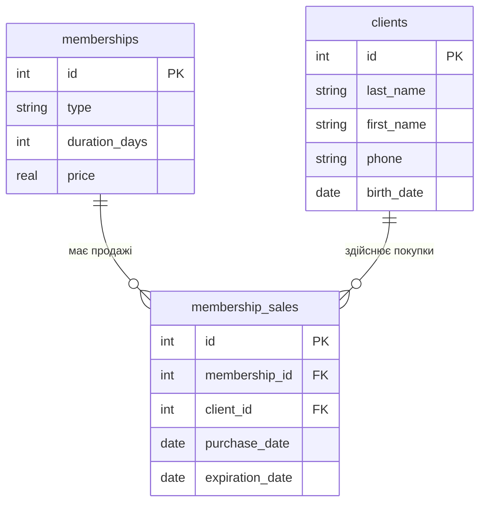

# Практична робота 3

## Створення ER-діаграми для заданої предметної області

**Виконала:** Діана Мельник
**Група:** I-23
**Варіант:** 7
**Предметна область:** Спортзал (фітнес-клуб)

### Мета роботи

Спроєктувати повну ER-модель предметної області «Спортзал (фітнес-клуб)», визначити зв'язки між таблицями, первинні та зовнішні ключі, а також проаналізувати структуру майбутньої бази даних без внесення змін до файлу бази даних.

---

## Завдання 1. ER-діаграма повної схеми

Для предметної області «Спортзал (фітнес-клуб)» використовуються дві вимірні таблиці `memberships` і `clients` та фактова таблиця `membership_sales`.

У діаграмі `memberships` і `clients` є вимірними таблицями. Таблиця `membership_sales` є фактовою, оскільки вона містить інформацію про конкретний продаж абонемента конкретному клієнту.

---

## Завдання 2. Тип кожного зв'язку

### Зв'язок `memberships` — `membership_sales`

Тип зв'язку — **1:N**.

Один тип абонемента може бути проданий багато разів різним клієнтам. Водночас кожен запис у `membership_sales` стосується лише одного конкретного абонемента.

### Зв'язок `clients` — `membership_sales`

Тип зв'язку — **1:N**.

Один клієнт може придбати багато абонементів протягом часу. Водночас кожен конкретний продаж абонемента належить одному клієнту.

Таким чином, обидва зв'язки в даній ER-моделі є зв'язками **1:N**.

---

## Завдання 3. Первинні й зовнішні ключі кожної таблиці

### Таблиця `memberships`

* Первинний ключ: `id`.
* Зовнішніх ключів немає.

### Таблиця `clients`

* Первинний ключ: `id`.
* Зовнішніх ключів немає.

### Таблиця `membership_sales`

* Первинний ключ: `id`.
* Зовнішній ключ `membership_id` посилається на `memberships.id`.
* Зовнішній ключ `client_id` посилається на `clients.id`.

Отже, таблиця `membership_sales` поєднує дві вимірні таблиці за допомогою двох зовнішніх ключів.

---

## Завдання 4. Додавання ще однієї сутності

До предметної області можна додати сутність **`trainers`**, яка зберігатиме інформацію про тренерів фітнес-клубу.

Нова таблиця може містити такі поля:

* `id` — ідентифікатор тренера;
* `last_name` — прізвище;
* `first_name` — ім'я;
* `phone` — номер телефону;
* `specialization` — спеціалізація тренера.

До діаграми можна додати таблицю `trainers` та таблицю занять, наприклад `training_sessions`, яка зберігатиме інформацію про проведені тренування.

Зв'язок між `trainers` і `training_sessions` буде **1:N**, оскільки один тренер може провести багато тренувань, а кожне конкретне тренування проводить один тренер.

---

## Завдання 5. Порівняння з прикладом

ER-діаграма фітнес-клубу має таку саму загальну структуру, як і приклад хімчистки.

В обох випадках є дві вимірні таблиці та одна фактова таблиця. Фактова таблиця містить власний первинний ключ і два зовнішні ключі, які посилаються на дві вимірні таблиці.

В обох моделях обидва зв'язки мають тип **1:N**. Одна вимірна сутність може відповідати багатьом записам у фактовій таблиці, а кожен запис фактової таблиці пов'язаний з одним записом відповідної вимірної таблиці.

Також у двох моделях вимірні таблиці не мають прямого зв'язку між собою. Вони пов'язані через фактову таблицю.

---

# Контрольні питання

### 1. Чим логічна модель відрізняється від концептуальної, і чим фізична — від логічної?

Концептуальна модель описує предметну область на загальному рівні: які сутності існують і як вони пов'язані між собою.

Логічна модель деталізує цю структуру: визначає таблиці, атрибути, первинні та зовнішні ключі та типи зв'язків, але ще не прив'язується повністю до конкретної системи керування базами даних.

Фізична модель описує безпосередню реалізацію бази даних у конкретній СУБД. У ній визначаються конкретні типи даних, обмеження, індекси та інші технічні характеристики.

### 2. Чому зв'язок M:N не можна реалізувати двома зовнішніми ключами в одній із двох основних таблиць?

Зв'язок M:N означає, що багато записів першої таблиці можуть бути пов'язані з багатьма записами другої таблиці.

Два зовнішні ключі в одній таблиці не можуть повністю представити таку кількість зв'язків. Тому для реалізації M:N створюють окрему проміжну таблицю, яка містить зовнішні ключі на обидві основні таблиці.

### 3. Що означають `||`, `o{`, `|{` у синтаксисі Mermaid `erDiagram`?

`||` означає **рівно один**.

`o{` означає **нуль або багато**.

`|{` означає **один або багато**.

Наприклад, запис:

`A ||--o{ B`

читається як: **один запис A може бути пов'язаний з нулем або багатьма записами B**.

---

## Висновок

Під час практичної роботи було спроєктовано ER-діаграму предметної області «Спортзал (фітнес-клуб)» для варіанта 7. Визначено дві вимірні таблиці `memberships` і `clients`, а також фактову таблицю `membership_sales` з двома зовнішніми ключами.

Для обох зв'язків визначено тип 1:N. Визначено первинні та зовнішні ключі таблиць, розглянуто можливість додавання нової сутності та проведено порівняння отриманої моделі з прикладом хімчистки.

Файл бази даних під час виконання цієї практичної роботи не змінювався.
