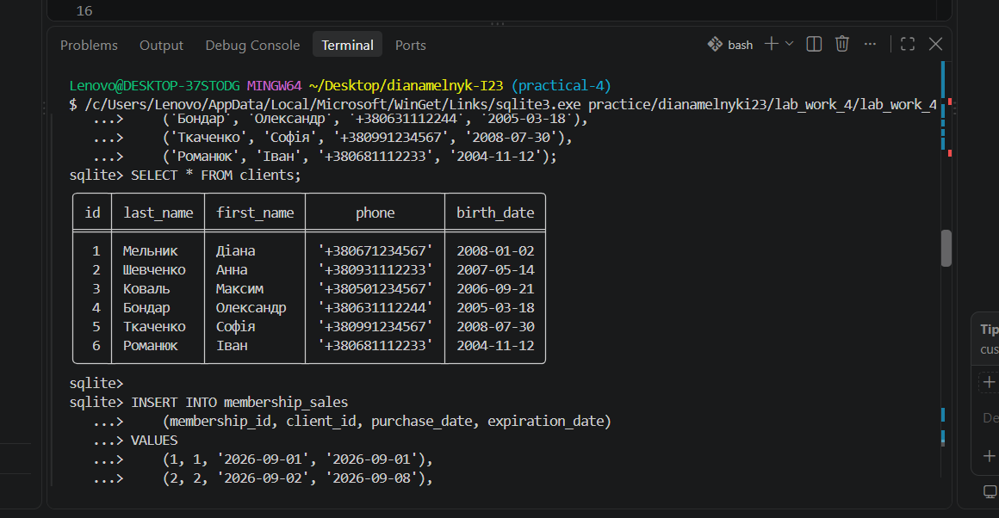
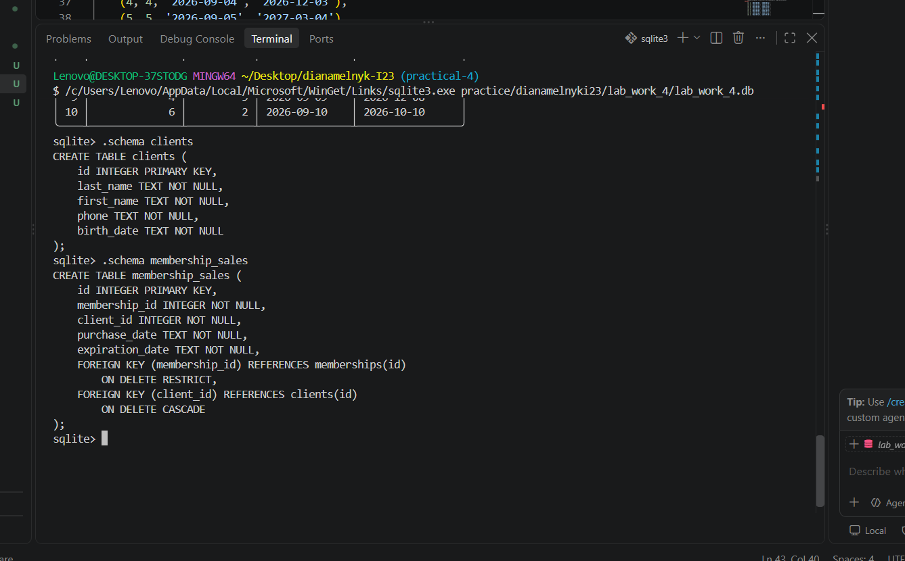
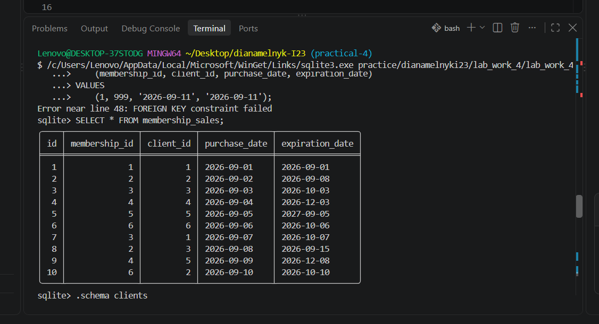
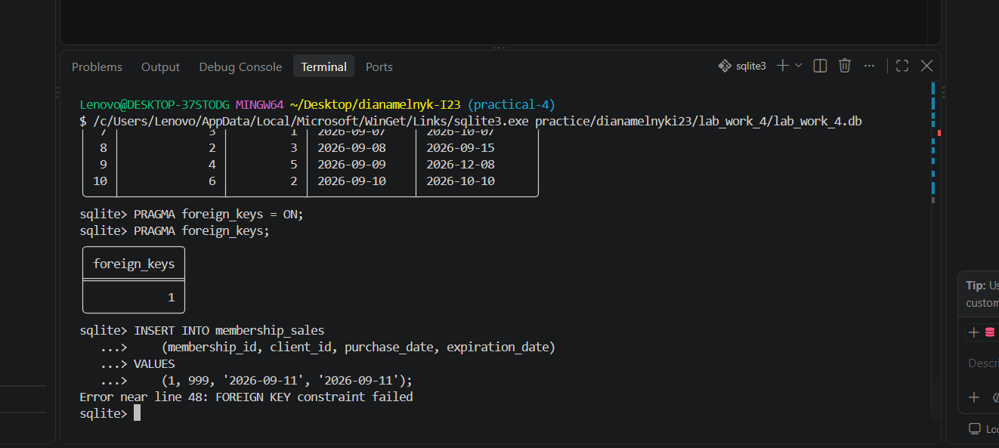
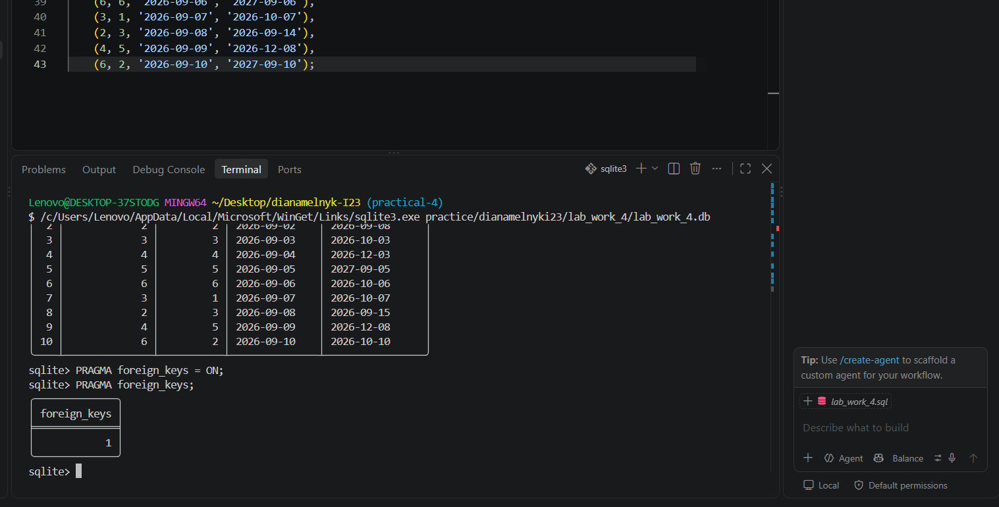

# Практична робота №4

## Тема

Додавання записів, встановлення ключів і зв'язків у базі даних SQLite.

## Варіант

7 — Фітнес-клуб.

## Мета роботи

Ознайомитися з додаванням записів до таблиць бази даних SQLite, створенням первинних та зовнішніх ключів, встановленням зв'язків між таблицями та перевіркою обмежень цілісності даних.

## Хід роботи

### 1. Створення таблиці клієнтів

Було створено таблицю `clients`, яка містить інформацію про клієнтів фітнес-клубу:

- ідентифікатор клієнта;
- прізвище;
- ім'я;
- номер телефону;
- дату народження.

До таблиці було додано 6 записів клієнтів.

### 2. Створення таблиці продажів абонементів

Було створено таблицю `membership_sales`, яка зберігає інформацію про продажі абонементів.

Таблиця містить:

- ідентифікатор продажу;
- ідентифікатор абонемента;
- ідентифікатор клієнта;
- дату придбання;
- дату завершення дії абонемента.

Для зв'язку з іншими таблицями використано зовнішні ключі.

Для поля `membership_id` встановлено дію `ON DELETE RESTRICT`. Це запобігає видаленню абонемента, якщо на нього вже існують посилання у продажах.

Для поля `client_id` встановлено дію `ON DELETE CASCADE`. У разі видалення клієнта пов'язані з ним записи про продажі видаляються автоматично.

### 3. Додавання записів

До таблиці `membership_sales` було додано 10 записів про продажі абонементів.

Усі записи містять коректні посилання на існуючих клієнтів та абонементи.

### 4. Перевірка зовнішніх ключів

Для поточного підключення SQLite було увімкнено перевірку зовнішніх ключів.

Результат перевірки:

`foreign_keys = 1`

Це підтверджує, що контроль зовнішніх ключів активний.

Для перевірки роботи обмежень було виконано спробу додати продаж із неіснуючим `client_id = 999`.

SQLite відхилив такий запис і вивів помилку:

`Error near line 48: FOREIGN KEY constraint failed`

Помилковий запис до таблиці не додався.

### 5. Перевірка відповідності ER-діаграмі

Структура створених таблиць відповідає ER-діаграмі, розробленій у практичній роботі №3.

В базі даних реалізовано такі зв'язки:

- `memberships` → `membership_sales` — зв'язок 1:N;
- `clients` → `membership_sales` — зв'язок 1:N.

Таблиця `membership_sales` є зв'язувальною таблицею між абонементами та клієнтами.

## Відповіді на контрольні питання

### 1. Для чого потрібна команда PRAGMA foreign_keys = ON?

Команда вмикає перевірку зовнішніх ключів у поточному підключенні SQLite. Вона забезпечує цілісність даних та не дозволяє створювати записи з посиланнями на неіснуючі записи батьківських таблиць. Налаштування діє для конкретного підключення, тому його потрібно встановлювати при кожному новому підключенні до бази даних.

### 2. Чим відрізняються PRIMARY KEY та FOREIGN KEY?

`PRIMARY KEY` однозначно ідентифікує кожен запис у таблиці.

`FOREIGN KEY` створює зв'язок із первинним ключем іншої таблиці та забезпечує посилальну цілісність даних.

### 3. Чим відрізняються CASCADE та RESTRICT?

`CASCADE` автоматично виконує відповідну дію для залежних записів. Наприклад, при видаленні клієнта можуть автоматично видалятися пов'язані з ним продажі.

`RESTRICT` забороняє видалення запису, якщо на нього існують залежні записи.

У цій роботі `CASCADE` використано для клієнтів, а `RESTRICT` — для абонементів відповідно до логіки предметної області.

## Висновок

Під час виконання практичної роботи було створено таблиці `clients` та `membership_sales`, додано записи клієнтів і продажів абонементів, встановлено зовнішні ключі та правила їх видалення. Також було перевірено роботу обмежень зовнішніх ключів за допомогою навмисного додавання некоректного запису. Структура бази даних відповідає розробленій раніше ER-діаграмі.