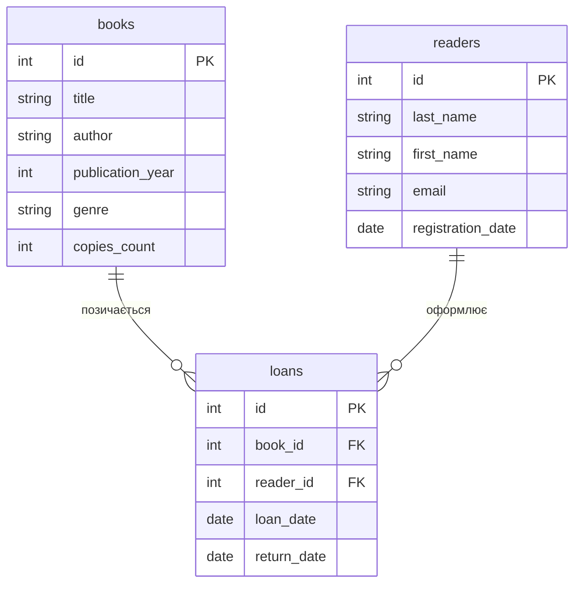

# Практична робота №3

## Створення ER-діаграм

**Варіант №1 — Бібліотека**

## Завдання 1. ER-діаграма повної схеми

## Завдання 2. Тип кожного зв'язку

### Зв'язок books — loans

Зв'язок між таблицями `books` та `loans` є **1:N (один до багатьох)**. Одна книга може бути видана багато разів різним читачам, тому їй можуть відповідати багато записів у таблиці `loans`. Кожен запис `loans` стосується лише однієї конкретної книги.

### Зв'язок readers — loans

Зв'язок між таблицями `readers` та `loans` також є **1:N (один до багатьох)**. Один читач може брати книги багато разів, тому йому можуть відповідати багато записів у таблиці `loans`. Кожен запис `loans` належить лише одному конкретному читачеві.

## Завдання 3. Первинні й зовнішні ключі кожної таблиці

### Таблиця books

- **Первинний ключ (PK):** `id`
- **Зовнішні ключі (FK):** відсутні.

### Таблиця readers

- **Первинний ключ (PK):** `id`
- **Зовнішні ключі (FK):** відсутні.

### Таблиця loans

- **Первинний ключ (PK):** `id`
- **Зовнішній ключ (FK):** `book_id` → `books.id`
- **Зовнішній ключ (FK):** `reader_id` → `readers.id`

## Завдання 4. Якщо додати ще одну сутність

До предметної області «Бібліотека» можна додати сутність `publishers` — видавництва.

Нова таблиця `publishers` може містити такі стовпці:

- `id` — первинний ключ;
- `name` — назва видавництва;
- `city` — місто;
- `email` — електронна пошта.

У таблиці `books` можна додати зовнішній ключ `publisher_id`, який посилатиметься на `publishers.id`.

Зв'язок між `publishers` і `books` буде **1:N**: одне видавництво може видати багато книг, а кожна книга належить одному видавництву.

Таким чином, на діаграмі з'явиться нова таблиця `publishers` та зв'язок `publishers ||--o{ books`.

Реалізовувати цю зміну в базі даних у межах Практичної 3 не потрібно.

## Завдання 5. Порівняння з прикладом

ER-діаграма бібліотеки має таку саму основну структуру, як і діаграма хімчистки з прикладу. В обох випадках є дві вимірні таблиці та одна фактова таблиця, яка містить два зовнішні ключі.

У бібліотеці таблиці `books` і `readers` є вимірними, а `loans` — фактовою таблицею. У прикладі хімчистки відповідно використовуються `services`, `clients` та `orders`.

В обох схемах зв'язки між вимірними та фактовими таблицями мають тип **1:N**. Одна книга може бути видана багато разів, а один читач може мати багато записів про видачу книг. Аналогічно, одна послуга хімчистки може бути використана в багатьох замовленнях, а один клієнт може створити багато замовлень.

Також у двох схемах вимірні таблиці не мають прямого зв'язку між собою. Вони пов'язані через фактову таблицю (`loans` у бібліотеці та `orders` у хімчистці).

## Контрольні питання

### 1. Чим логічна модель відрізняється від концептуальної, і чим фізична — від логічної?

Концептуальна модель описує предметну область на загальному рівні: які існують сутності та як вони пов'язані між собою. Логічна модель деталізує цю структуру до таблиць, стовпців, ключів та зв'язків, але ще не прив'язується до конкретної СУБД. Фізична модель описує реальну реалізацію бази даних у конкретній СУБД із конкретними типами даних, обмеженнями та іншими технічними особливостями.

### 2. Чому зв'язок M:N не можна реалізувати двома зовнішніми ключами в одній із двох основних таблиць і завжди потрібна окрема таблиця?

Зв'язок M:N означає, що один запис першої таблиці може бути пов'язаний з багатьма записами другої, і навпаки. Один зовнішній ключ може містити посилання лише на один конкретний запис, тому двох звичайних зовнішніх ключів недостатньо для зберігання всіх зв'язків. Для цього створюють окрему проміжну таблицю, яка містить зовнішні ключі обох таблиць.

### 3. Що означають позначення ||, o{, |{ у синтаксисі mermaid erDiagram?

`||` означає «рівно один». `o{` означає «нуль або багато». `|{` означає «один або багато».

Рядок `A ||--o{ B` читається як: «один запис A може бути пов'язаний з нулем або багатьма записами B». Такий зв'язок має тип **1:N**.

## Висновок

Під час практичної роботи було спроєктовано повну ER-діаграму предметної області «Бібліотека» для варіанта №1. Було визначено дві вимірні таблиці `books` і `readers` та фактову таблицю `loans`, яка містить два зовнішні ключі. Для обох зв'язків визначено тип 1:N, а також описано первинні та зовнішні ключі. Додатково було розглянуто можливість додавання сутності `publishers` та проведено порівняння структури бібліотеки з прикладом хімчистки.