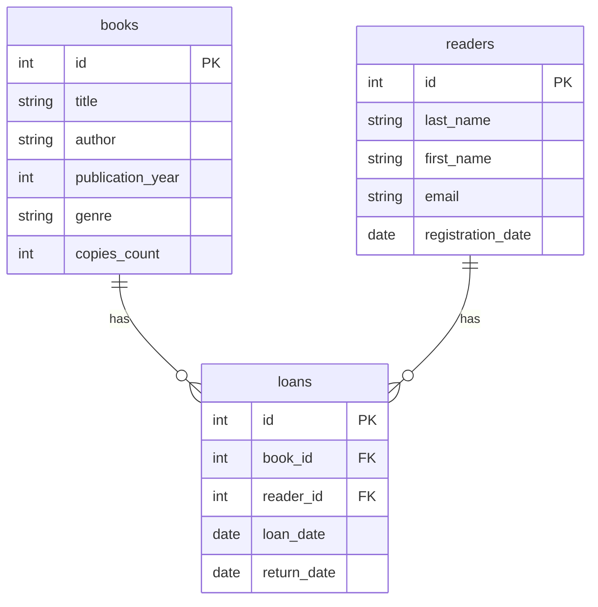

# Практична робота №3

## Створення ER-діаграми

### Варіант 1 — Бібліотека

## Завдання 1. ER-діаграма повної схеми

## Завдання 2. Тип кожного зв'язку

### books — loans

Зв'язок між `books` і `loans` є 1:N. Одна книга може бути видана багато разів у різні моменти часу, тому для однієї книги може існувати багато записів у таблиці `loans`. Кожен запис `loans` стосується лише однієї книги через `book_id`.

### readers — loans

Зв'язок між `readers` і `loans` також є 1:N. Один читач може брати книги багато разів, тому для одного читача може бути багато записів у таблиці `loans`. Кожен запис `loans` належить одному читачеві через `reader_id`.

## Завдання 3. Первинні та зовнішні ключі

### books

* Первинний ключ: `id`.
* Зовнішніх ключів немає.

### readers

* Первинний ключ: `id`.
* Зовнішніх ключів немає.

### loans

* Первинний ключ: `id`.
* `book_id` — зовнішній ключ, який посилається на `books(id)`.
* `reader_id` — зовнішній ключ, який посилається на `readers(id)`.

## Завдання 4. Додавання ще однієї сутності

До предметної області «Бібліотека» можна додати сутність `publishers` — видавництва.

Таблиця `publishers` могла б містити `id`, `name`, `city` та інші дані про видавництво. У таблиці `books` можна було б додати `publisher_id` як зовнішній ключ на `publishers(id)`.

Зв'язок між `publishers` і `books` був би 1:N: одне видавництво може видати багато книг, а кожна книга належить одному видавництву.

Реалізовувати цю зміну в базі даних у цій практичній роботі не потрібно.

## Завдання 5. Порівняння з прикладом

Схема бібліотеки має таку саму загальну структуру, як приклад хімчистки. В обох випадках є дві вимірні таблиці та одна фактова таблиця, яка має два зовнішні ключі. Обидва зв'язки мають тип 1:N. Вимірні таблиці не пов'язані безпосередньо між собою, а з'єднуються через фактову таблицю.

## Контрольні питання

### 1. Чим логічна модель відрізняється від концептуальної, і чим фізична — від логічної?

Концептуальна модель описує предметну область на загальному рівні: основні сутності, їхні властивості та зв'язки між ними. Логічна модель перетворює цю структуру на таблиці, стовпці, ключі та зв'язки, але ще не прив'язує її до конкретної СУБД. Фізична модель описує реалізацію бази даних у конкретній СУБД із конкретними типами даних, обмеженнями, індексами та іншими технічними деталями.

### 2. Чому зв'язок M:N не можна реалізувати двома зовнішніми ключами в одній із двох основних таблиць?

Тому що при зв'язку M:N один запис першої таблиці може бути пов'язаний з багатьма записами другої, і навпаки. Один зовнішній ключ у таблиці може посилатися лише на один конкретний запис іншої таблиці. Тому для M:N створюють окрему проміжну таблицю, яка містить зовнішні ключі на обидві основні таблиці.

### 3. Що означають `||`, `o{`, `|{` у Mermaid і як прочитати `A ||--o{ B`?

`||` означає «рівно один», `o{` означає «нуль або багато», а `|{` означає «один або багато».

Запис `A ||--o{ B` означає, що одному запису A може відповідати нуль або багато записів B, а кожен запис B пов'язаний рівно з одним записом A.
