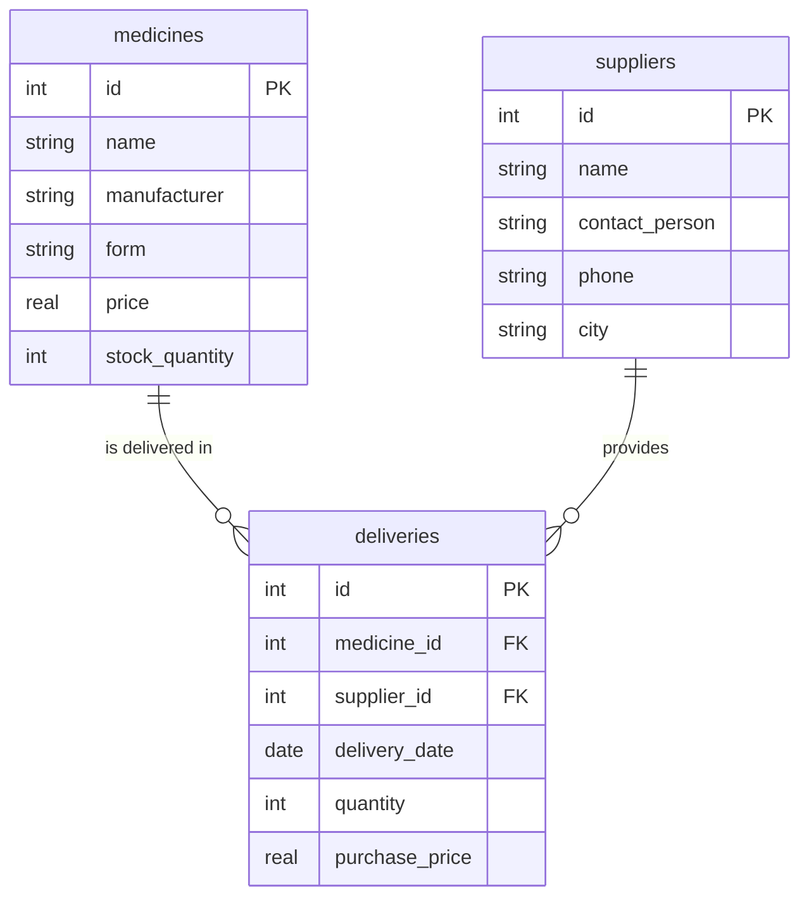

# Practice 3 — ER-diagram for the Variant 4 (Pharmacy) schema

**Variant:** 4 — Apteka (Pharmacy)
**Full schema (planned, no database file is touched in this practice):**

- Dimension table 1 — `medicines(id, name, manufacturer, form, price, stock_quantity)`
- Dimension table 2 — `suppliers(id, name, contact_person, phone, city)`
- Fact table — `deliveries(id, medicine_id → medicines.id, supplier_id → suppliers.id, delivery_date, quantity, purchase_price)`

## Task 1. ER-diagram (mermaid erDiagram)



Rows of the variant table (dimension 1 created in Practice 1; dimensions 1 and 2
plus the fact table form the full schema):

```
medicines(id, name, manufacturer, form, price, stock_quantity)
suppliers(id, name, contact_person, phone, city)
deliveries(id, medicine_id → medicines.id, supplier_id → suppliers.id,
           delivery_date, quantity, purchase_price)
```

## Task 2. Type of each relationship

**`medicines ||--o{ deliveries` — 1:N.** Exactly one medicine (e.g. "Paracetamol") is
delivered many times — a pharmacy orders the same drug from a supplier repeatedly
over the months (or not yet at all if it is a newly listed drug). But every specific
delivery record concerns exactly one medicine — one row of `deliveries` cannot
simultaneously deliver two different drugs.

**`suppliers ||--o{ deliveries` — 1:N.** Exactly one supplier performs zero or many
deliveries: a regular partner (e.g. "Optima-Pharm") brings dozens of deliveries over
time, while a newly added supplier may have none yet. But every delivery is made by
exactly one supplier.

There is **no direct link** between `medicines` and `suppliers` — they are connected
only *through* the fact table `deliveries`. That is exactly how a fact table works: it
joins two dimension tables that are not directly related to each other.

## Task 3. Primary and foreign keys of each table

**medicines**
- Primary key: `id`
- Foreign keys: none

**suppliers**
- Primary key: `id`
- Foreign keys: none

**deliveries**
- Primary key: `id`
- Foreign keys:
  - `medicine_id` → references `medicines.id`
  - `supplier_id` → references `suppliers.id`

(The actual `PRIMARY KEY` / `FOREIGN KEY` SQL syntax appears only in Practice 4,
when the keys are really created in the database file.)

## Task 4. If one more entity were added

For a pharmacy we add the entity **`customers`** (end customers who buy drugs for
themselves). The diagram would gain a new table:

```
customers(id, last_name, first_name, phone)
```

Each sale is made by exactly one customer, and one customer makes many purchases.
So a new link `customers ||--o{ sales` of type **1:N** would be added, and a new fact
table `sales(id, medicine_id FK, customer_id FK, sale_date, quantity, price)`
would connect the existing `medicines` dimension with the new `customers` dimension.
The diagram would then have three dimension tables and two fact tables, with no direct
link between `customers` and `medicines`.

## Task 5. Comparison with the example

Our diagram is structurally identical to the "dry-cleaning" example
(`services`, `clients`, `orders`): both consist of **two dimension tables and one fact
table with two foreign keys**; both relationships in both diagrams are **1:N**; and in
both cases the two dimension tables are related **only through the fact table**, never
directly. The only differences are the domain names (`medicines`/`suppliers`/`deliveries`
vs `services`/`clients`/`orders`) and the fact that `deliveries` describes a supply
between a medicine and a supplier, while `orders` describes a service rendered to a client.
