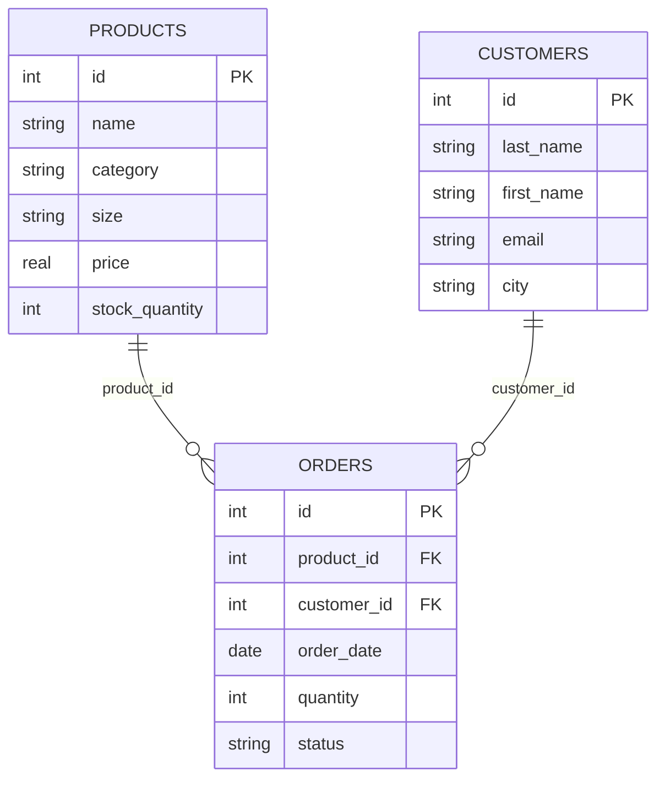
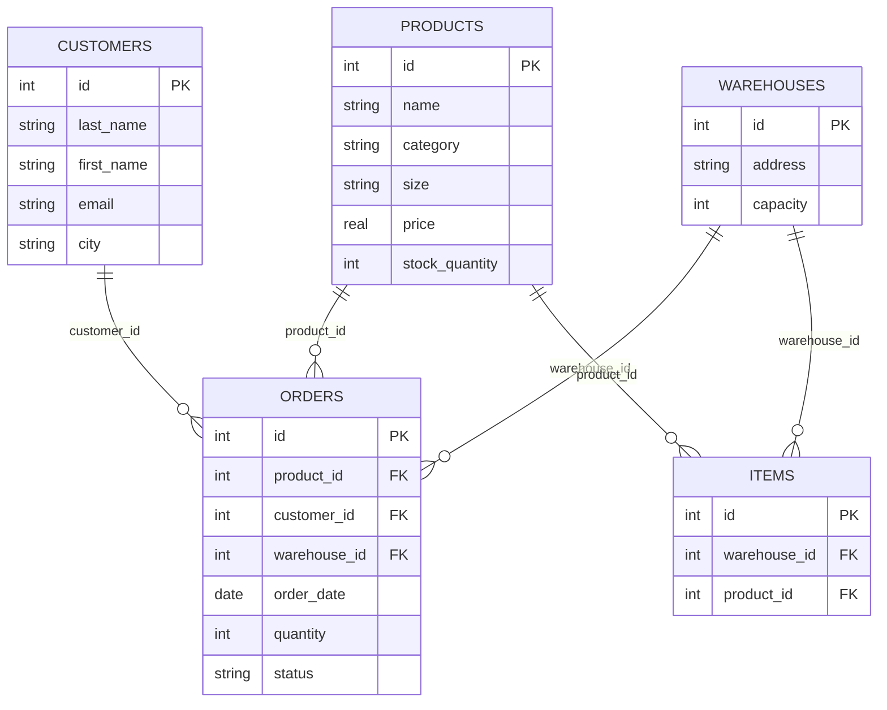

**Варіант 2**

**Завдання 1**

**Завдання 2**

Зв'язок від продуктів до замовлень є 1:N, бо ми можемо передати id одного продукту у безліч замовлень, а не інакше. Зв'язок від клієнтів до замовлень теж є 1:N, бо дані замовника згодяться у багатьох замовленнях. Тим часом замовлення немає безлічі клієнтів чи товарів.

**Завдання 3**

Primary keys:

* id у таблиці products;
* id у таблиці customers;
* id у таблиці orders;

Foreign keys:

* product\_id у таблиці orders, береться з id у products;
* customer\_id у таблиці orders, береться з id у customers;

**Завдання 4**

Можна додати сутність Warehouses. У ній вказати id, address, capacity та items. Тоді його можна зв'язати з products як M:N, але так не вийде зробити, тому поле items стане фіктивною таблицею з id від warehouses id та products. До неї зв'язок буде 1:N з обох таблиць. Warehouses можна прив'язати до orders, вказавши з якого складу буде замовлення. Це вже зв'язок 1:N.

**Завдання 5**

Діаграма схожа на діаграму з прикладу тим, що має дві основні таблиці і одну фактову, кожна таблиця має PK, у фактовій два FK, також схожий зв'язок основних таблиць із фактовою: 1:N, а основні між собою напряму не взаємодіють.

**Контрольні питання**

Чим логічна модель відрізняється від концептуальної, і чим фізична — від логічної?

Концептуальна модель містить лиш сутності й інформацію про те, що з чим взаємодіятиме, логічна вже має певні типи даних, типи зв'язку і має діаграму, а фізична модель - це вже створена база даних із таблицями та зв'язками.

Чому зв'язок M:N не можна реалізувати двома зовнішніми ключами в одній із двох основних таблиць і завжди потрібна окрема таблиця?
Тому що одне поле не може мати безліч зовнішніх ключів, а тільки один. Через це зв'язок M:N можна реалізувати через два 1:N зв'язки і ніяк інакше.

Що означають позначення ||, o{, |{ у синтаксисі mermaid erDiagram, і як прочитати вголос рядок A ||--o{ B? 

|| означає рівно один, o{ позначає нуль або більше, а |{ - один або більше. A ||--o{ B читається як одне A відповідає нулю або більше B

