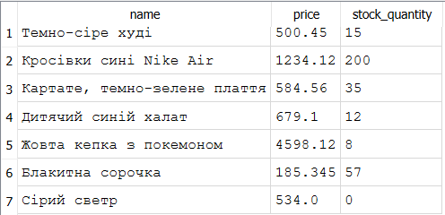

**Завдання 4**  

**Завдання 5**  
-- At line 1:  
UPDATE products SET price = -454 WHERE name = "Сірий светр"  
-- Result: CHECK constraint failed: price >= 0

-- At line 1:  
INSERT INTO products (name, price, stock_quantity) VALUES
  ("Панчохи білі", -5, 34)  
-- Result: CHECK constraint failed: price >= 0

При INSERT та при UPDATE CHECK діє однаково, тому що видає однакові помилки  
**Завдання 6**
1. Стовпці name, price, stock_quantity у таблиці products потребували NOT NULL, тому що без них було би важко знати назву, ціну та кількість товару на складі;
2. Email в customers потребує Unique, бо дві людини не можуть мати однієї пошти;
3. Для price у products було задано CHECK, тому що ціна не має від'ємних значень;
4. Stock_quantity має DEFAULT, бо товар можуть додати наперед якраз перед надходженням товару.  

**Контролюючі питання**  
Чому в SQLite неможливо просто виконати ALTER TABLE ... ADD CONSTRAINT CHECK (...), і що доводиться робити замість цього?  
Після створення таблиці неможливо змінити у ній базові налаштування, бо після зміни може відбутися помилка. Замість цього створюють нову таблицю і туди перекидають дані зі старої

Що станеться, якщо перестворити таблицю, додавши NOT NULL до стовпця, у якому серед наявних рядків уже є NULL?  
Буде помилка, бо NOT NULL забороняє NULL.  

Чим перевірка CHECK, доданого через перестворення таблиці, відрізняється від перевірки CHECK, оголошеного одразу при CREATE TABLE?  
CHECK нічим не відрізняється, окрім того, що перевірка у першому випадку перевіряє дані, які переносяться, а в іншому - ті що додаються.

Чому DEFAULT не можна перевірити тим самим способом, що й NOT NULL/UNIQUE/CHECK (спробою порушення), і як його перевіряють замість цього?  
Тому що його неможливо ніяк порушити. Його можна перевірити через вставлення даних без стовпця, а потім вивести через SELECT.