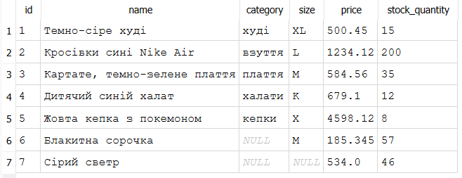

**Завдання 2**  
Тут доречний UPDATE, тому що якщо видалити і додати то втратиться зв'язок або може відбутися помилка через FOREIGN KEY.  
**Завдання 4**  
Прогноз: При видаленні продукту видасть помилку

Результат: 
-- At line 1:
DELETE FROM products WHERE id = 5
-- Result: FOREIGN KEY constraint failed

Порівняння: Результат збігається з прогнозом

**Контролюючі питання**  
Чим UPDATE ... SET колонка = колонка + 1 відрізняється від UPDATE ... SET колонка = <конкретне число>?  
UPDATE ... SET колонка = колонка + 1 задає значення відштовхуючись від наявного, а UPDATE ... SET колонка = <конкретне число> просто задає нову інформацію.

Чому обмеження NOT NULL/UNIQUE/CHECK (Практика 5) завжди перевіряються при UPDATE, тоді як FOREIGN KEY — лише за умови PRAGMA foreign_keys = ON;?  
Тому що NOT NULL/UNIQUE/CHECK перевіряються зразу, а перевірка зовнішніх ключів за замовченням вимкнута у SQLite.  

Якби на вашій фактовій таблиці FK було оголошено з ON DELETE CASCADE замість RESTRICT (Лекція 5), як це змінило б наслідки видалення рядка з таблиці-вимір, на яку та фактова таблиця посилається?  
Тоді видалення відбулося б без помилки, а також було би видалено пов'язані рядки у фактовій таблиці.

Чому DELETE без WHERE небезпечніший за помилку типу чи порушення обмеження цілісності?  
Тому що DELETE без WHERE видалив би всі дані у таблиці, що є великою проблемою, бо дані буде втрачено, а вони є основою баз даних.