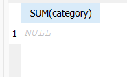

**Завдання 1**

Спочатку збігалися, але потім було перероблено таблицю, щоб можна було поставити NULL

**Завдання 2**

Сума всіх товарів по одному: 8315.695
Середня ціна всіх товарів по одному: 1187.95642857143

**Завдання 3**

Найменше та найбільше значення були визначені по алфавіту(В, П)

**Завдання 5**

Змінилася кількість замовлених товарів та інші дані в результаті. WHERE прибрав інші замовлення, які не відповідали умові

**Контрольні питання**

Чому COUNT(\*) і COUNT(колонка) можуть повернути різні числа на тій самій таблиці, а COUNT(\*) і COUNT(id) — практично завжди однакові (якщо id — первинний ключ)?  
Тому що у колонці може бути NULL, який не враховується в обчисленнях. З id таке навряд буде, бо NULL зазвичай не ставлять ключем

Якби в таблиці було 5 рядків із числовою колонкою, і в одному з них значення NULL, чому дорівнював би знаменник при обчисленні AVG цієї колонки — 5 чи 4? Чому саме так?  
Дорівнюва би чотирьом, тому що NULL не враховується

Що поверне SUM(колонка), якщо взагалі всі рядки мають NULL у цій колонці — 0, NULL, чи помилку? Перевірте на своїй базі, якщо можете створити такий випадок, і зафіксуйте результат.  
Поверне NULL.

Перевірка:

```SQl
SELECT SUM(category)
FROM products
WHERE id > 5 
```

