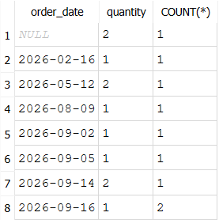

**Завдання 1**

Кожен рядок показує кількість товарів, замовлених кожним клієнтом за id

**Завдання 4**

Було 8 унікальних значень дати і 4 унікальні значення статусу. Ми отримали в результаті 8 рядків, бо групували за унікальним поєднанням ключів(якби ще були б однакові дати з різними статусами, то отримали б більше рядків)

**Завдання 5**

Значення однакові, але на цей результат не можна покладатися, бо невідомо за чим сортується, а також не всі дані виводяться

**Контрольні питання**

Чому запит із GROUP BY у Завданні 2 має групувати за id таблиці-виміру, а не за її текстовою колонкою (назвою, прізвищем)?  
Тому що зазвичай id є унікальним і так не можна групувати двох різних клієнтів через однакові дані(наприклад, прізвище може повторюватись)

Якби в запиті Завдання 2 замінити LEFT JOIN на INNER JOIN, які рядки результату могли б зникнути?  
Могли б зникнути рядки, які не мали зв'язку із фактовою таблицею

Запит Завдання 5 у SQLite виконався без помилки. Звідки взялося значення в "зайвій" колонці, чому на нього не можна покладатися, і що зробив би з цим самим запитом PostgreSQL? Перевірте на своїй базі, якщо можете створити такий випадок, і зафіксуйте результат.  
Значення у зайвій колонці взялося від першого значення, яке трапилось. Через це на нього не можна покладатися, а також через те, що дані можуть не відображатися повністю. PostgreSQL вивів би помилку.

Результат:

В останній колонці показало кількість одного замовлення, хоча в той день була більша кількість замовленого